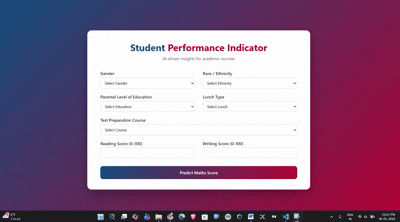

# 🎓 Student Performance Indicator  

A complete **end-to-end Modular Machine Learning project** that predicts a student’s **Maths score** based on demographic and academic attributes. The system combines **data analysis, machine learning pipelines, and a FastAPI web application** to deliver real-time predictions.

🏆 **Best Model:** Ridge Regression  
📊 **R² Score:** 0.880593  

---

- **Live Demo:** [Student Performance Indicator](https://student-performance-indicator-project.onrender.com)

---


## 🎥 Demo



---

## 📌 Table of Contents
- [Why This Project Exists](#why-this-project-exists)
- [Features](#features)
- [Usage](#usage)
- [Technologies Used](#technologies-used)
- [Project Structure](#project-structure)
- [Setup Instructions](#setup-instructions)
- [Live Demo](#live-demo)

---

## Why This Project Exists

Student performance is influenced by **multiple hidden factors** such as:
- Parental education
- Test preparation
- Gender
- Lunch type
- Reading & writing skills

Traditional grading systems **do not analyze these relationships**.

**This project solves that problem by:**
- Applying Machine Learning to **understand performance patterns**
- Predicting student scores **before exams**
- Helping educators and institutions **identify students who need support early**

📌 **Goal:** Data-driven insights for better academic decision-making.

---

## 🚀 Features

### 📊 Data Analysis & Modeling
- In-depth **Exploratory Data Analysis (EDA)**
- Feature correlation and pattern discovery
- Multiple regression models trained and compared
- Best-performing model selected based on R² score

### ⚙️ Machine Learning Pipeline
- Automated preprocessing for numerical & categorical features
- Scikit-learn pipelines for clean, reusable ML workflows
- Ridge Regression used to handle multicollinearity

### 🌐 Web Application
- **FastAPI**-based backend (modern, high-performance, async-ready)
- Simple and interactive UI with Jinja2 templates
- Real-time Maths score prediction
- Automatic API documentation at `/docs`
- Input validation and error handling

### 🧱 Software Engineering Practices
- Modular project structure
- Custom logging and exception handling
- Scalable and maintainable codebase

---

## 🧪 Usage

### 1. Input Student Details
The user enters:
- Gender
- Race/Ethnicity
- Parental education
- Lunch type
- Test preparation status
- Reading score
- Writing score

### 2. Prediction
- The trained ML model processes the inputs
- A predicted **Maths score** is generated instantly

### 3. Output
- Displayed directly on the web interface
- Can be used for academic insights or intervention planning

---

## 🛠️ Technologies Used

### **Programming & Machine Learning**
- **Python**
- **NumPy & Pandas**
- **Scikit-learn**
- **CatBoost** (used during model comparison)

### **Web Framework**
- **FastAPI** – Modern, fast (ASGI), automatically generates interactive API docs
- **Uvicorn** – ASGI server for running FastAPI
- **Jinja2** – Template engine for HTML rendering
- **HTML5 / CSS3** – Frontend interface

### **Tools**
- **Jupyter Notebook** – EDA & experimentation
- **Git & GitHub** – Version control

---

## 📁 Project Structure


Student-Performance-Project/<br>
├── notebook/                   # Jupyter notebooks<br>
│   ├── data/<br>
│   │   └── stud.csv            # Dataset<br>
│   ├── EDA.ipynb               # Exploratory Data Analysis<br>
│   └── Model_Training.ipynb    # Model training & evaluation<br>
│<br>
├── src/                        # Source code<br>
│   ├── components/             # Data ingestion, transformation, model trainer<br>
│   ├── pipeline/               # Training & Prediction pipelines<br>
│   │   └── predict_pipeline.py<br>
│   ├── utils.py                # Utility functions<br>
│   ├── logger.py               # Logging configuration<br>
│   └── exception.py            # Custom exception handling<br>
│<br>
├── templates/                  # HTML templates<br>
│   └── index.html              # Frontend UI<br>
│<br>
├── app.py                      # FastAPI application entry point<br>
├── requirements.txt            # Python dependencies<br>
├── setup.py                    # Project setup file<br>
└── README.md                   # Project documentation<br>

---

## Setup Instructions

### Prerequisites

To run this project locally, ensure you have the following installed:
- Python 3.8+
- Git
- Virtual environemnt (recommended)

<br>

### Steps
1. **Clone the Repository**:
   ```bash
   git clone https://github.com/Umer2900/Student-Performance-Indicator-Project
   cd Student-Performance-Project
   ```

2. **Install Dependencies**:
   ```bash
   python -m venv venv
   venv\Scripts\activate       # Windows
   ```

3. **Install Dependencies**:
   ```bash
   pip install -r requirements.txt
   ```

4. **Run the Application**:
   ```bash
   uvicorn app:app --reload
   ```
   The app will be available at 🌐 `http://127.0.0.1:8000/`.

<br>